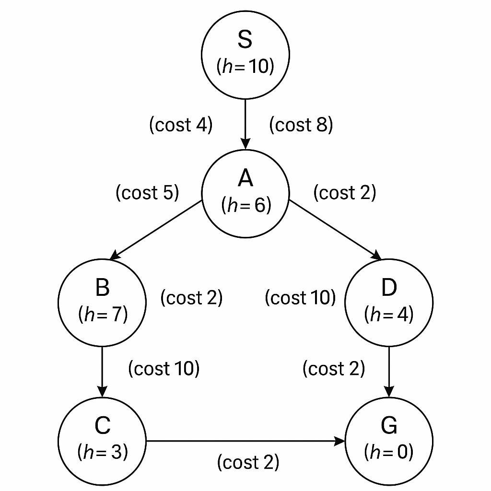

# Homework-of-AI-course-2

# Module 2 – A* Search Exercises

## 🎯 Objective
To understand the A* evaluation function and to implement the A* algorithm.

---

## 🧩 Exercise 1: Trace A* Search (Conceptual)

**Graph used:**

Each node has a heuristic value **h(n)**, and edge labels show the path costs.

**Steps:**
1. Start at **S (h=10)**.
2. Compute f(n) = g(n) + h(n) for all neighbors.
3. Expand nodes in increasing order of f(n).
4. The first time we reach **G**, we stop.

**Final Results:**
- Path found: `S → G`
- Total cost: **2**
- Sequence expanded: **S → G**
- A* finds the optimal path because it uses both the actual cost g(n) and heuristic h(n).  
  Greedy Search only uses h(n), so it may choose suboptimal routes.

---

## 💻 Exercise 2: Implement A* Search (Coding)
## Exercies 2: is in Code.ipynb

